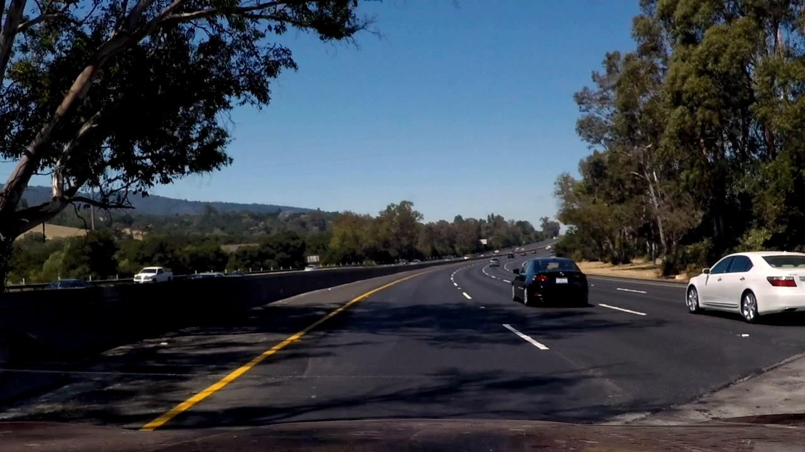
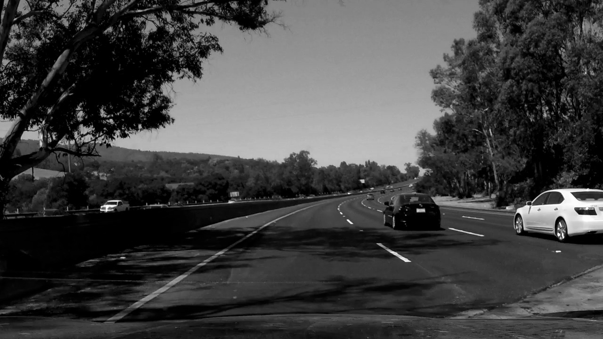
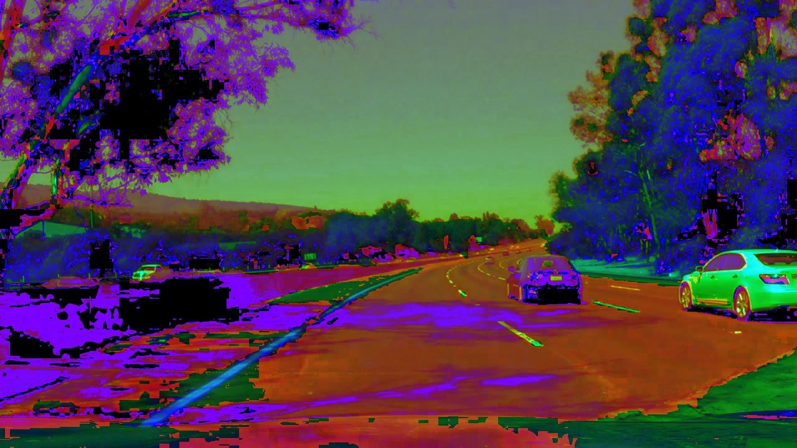
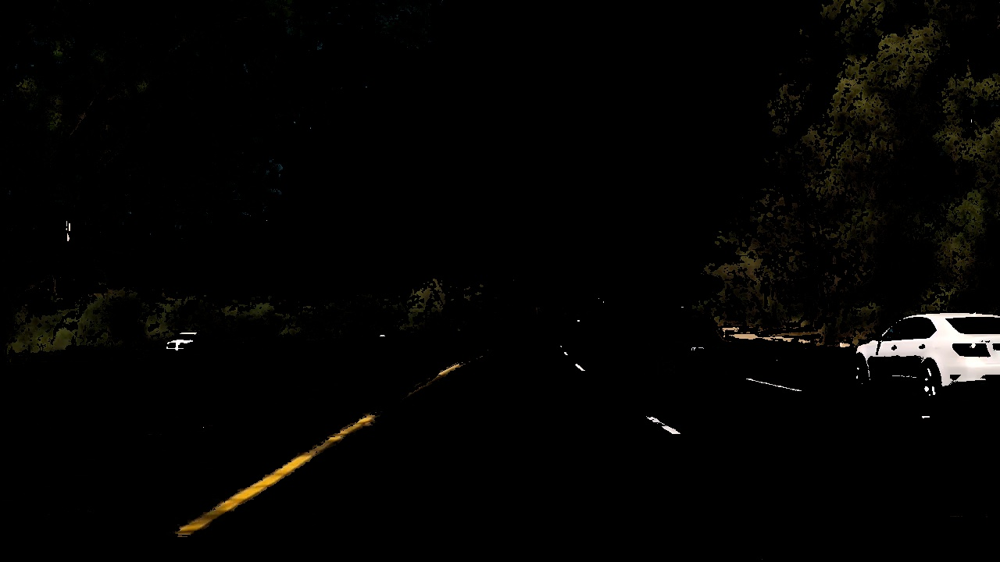
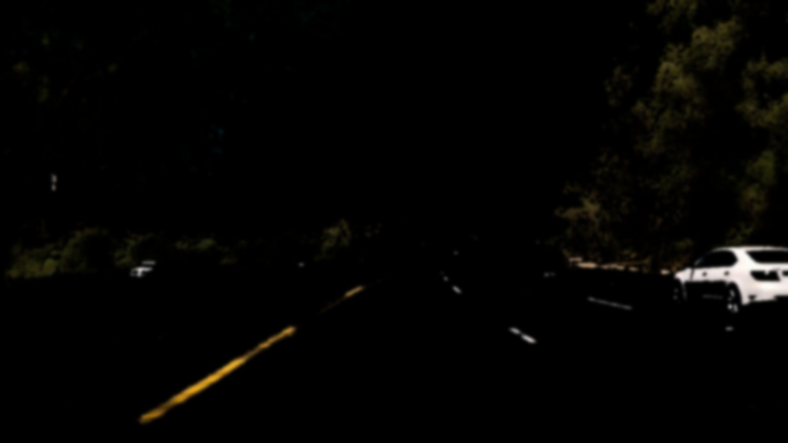
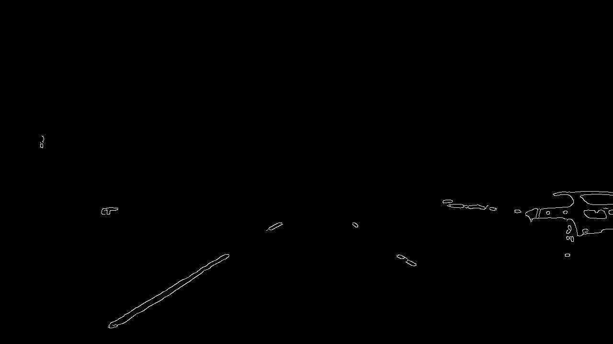
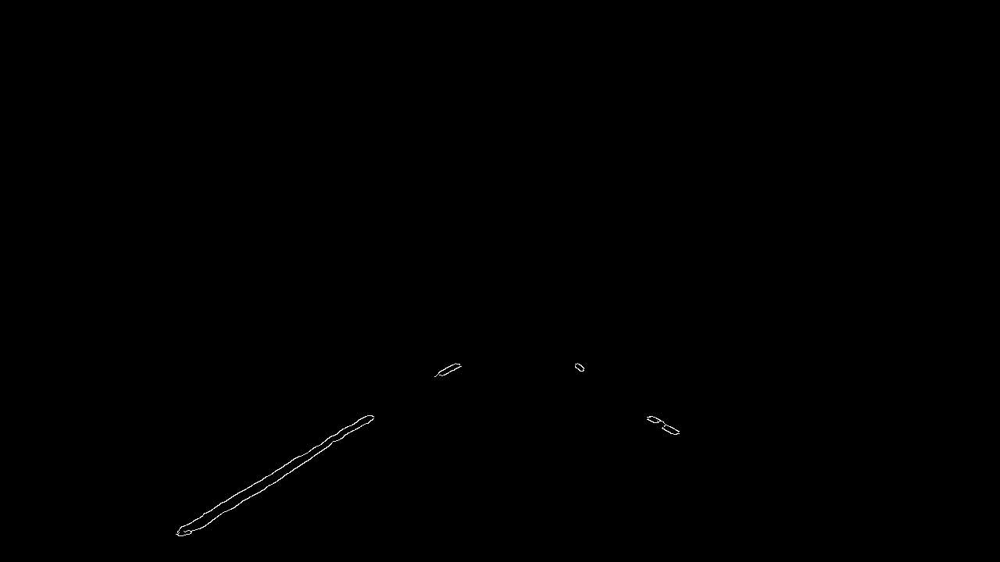
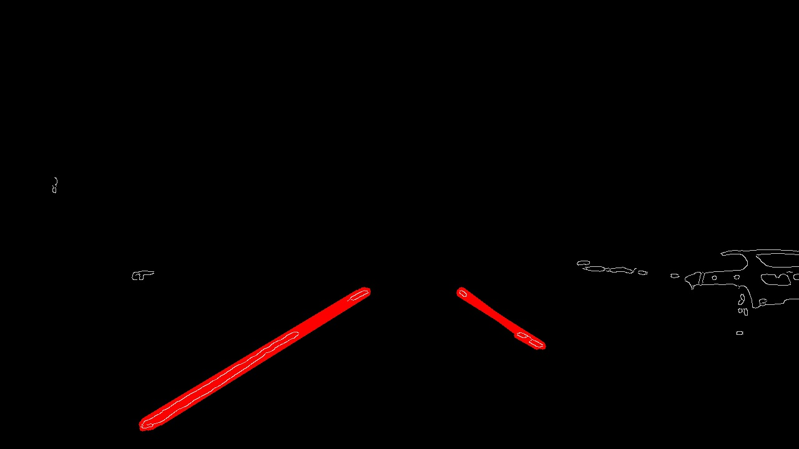
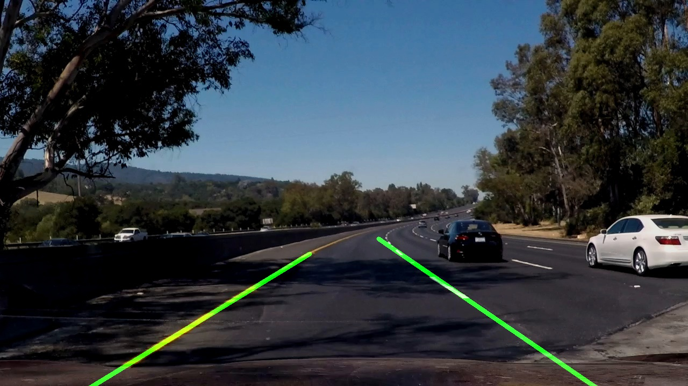

# **Finding Lane Lines on the Road** 

---

**Finding Lane Lines on the Road**

The goals of this project are the following:
* Detect lanes on test images and videos while driving on the highway under reasonably well lighting conditions
  * No snow on the road
  * No rain
  * Some shadows from trees and other objects are acceptable

---

### Reflection

### 1. The Pipeline.
My pipeline consists of two main steps: 

#### a. Identifying lines 
 This workflow further consists of several steps. Initially I tried converting the images to grayscale followed by Gaussian blurring and then Canny edge detection followed by Hough transform to get detect the lanes. This method worked well when the lighting was good - meaning no shadows or other discolouration. Also, this procedure worked well for all white lines. But in cases where there are shadows or for yellow lines, the process did not alwyas give good results. 

 Image with shadow and yellow lane			       |	Grayscale
 -------------------------------------------|-----------------------------------------
   |	

 To over come this, instead of grayscale, I converted the image to HSL colour scheme, which shows yellows much better even in shadows. 

 Image with shadow and yellow lane			       |	HSL
 -------------------------------------------|-----------------------------------------
   |	

 This step is followed by Gaussian blurring kernel=15 to remove tiny features and then canny edge detection. The result is seen below. It is clear that the lanes are identified pretty well even with the shadow.

 **Step a.1: Colour Selection**

 

 **Step a.2: Gaussian blurring**

 

 **Step a.3: Canny edges**

 

 **Step a.4: Edges in region of interest**

 

 **Step a.5: Hough lines**

 

 **Step a.5: Final**

 

#### b. Averaging the lines
Once **Step a** is done, it is time to average all the lines detected on the two lanes and plot it on the original image. This includes following. 

**Step b.1:** Calculate the slope, intercept, and the line length. Line length will be used as the weight of the line.

**Step b.2:** Separate the positive and negative slope lines.

**Step b.3:** Remove outliners which are more than 1.5 standard deviation slope from the mean. This helps reduce jitter a little.

**Step b.4:** Take weighted average of the lines on the left and right lanes (calculate both slope and intercept).

**Step b.5:** To draw the averages line, calculate the end points using the y = mx+c with x = 0, 0.45\times image_width, 0.55\times image_width, image_width

This algorithm was able to identify lanes in all the [test images](test_images_output) as well as the [videos](test_videos_output).

### 2. Potential short comings
There are a number of short comings of the algorithm:

1. It takes a lot of time to manually tune paramaters for colour selection, edge detection, and Hough transform to make sure that the code performs robustly for all scenarios. Even with this, we can only cover a limited number of scenarios. Even in the example videos, the weather conditions are perfect - line markings are very good. In absence of either of these, the algorithm will fail.
2. The algorithm can only identify straight lines. In case the image does not have straight line long enough, there would be a failure.
3. The perspective is such that other lanes are not visible very clearly. The region of interest marking further completely occludes the view of other lane markings. If the vehicle wanted to change lanes, this would make it difficult if not impossible.
4. The lanes detected are very jittery because there is no memory built into the code or because there is not filtering. This can be corrected pretty easily using simple moving average filter.
5. If the perspective is such that both the lanes lines have negative slope, this algorithm will fail.

### 3. Possible improvements

I will try to address improvements for each of the five points above:

1. Machine learning!
2. Need to update the algorithm to include curved lines.
3. Remove the region of interest masking and detect all lane lines in the visible image
4. Moving average filter. Better still : Kalman Filtering. Using the states of the car (e.g. speed, steering) to estimate how the end points of the detected lines will move.
5. Make sure the hardware is located such that this perspective hold true for any scenario.

